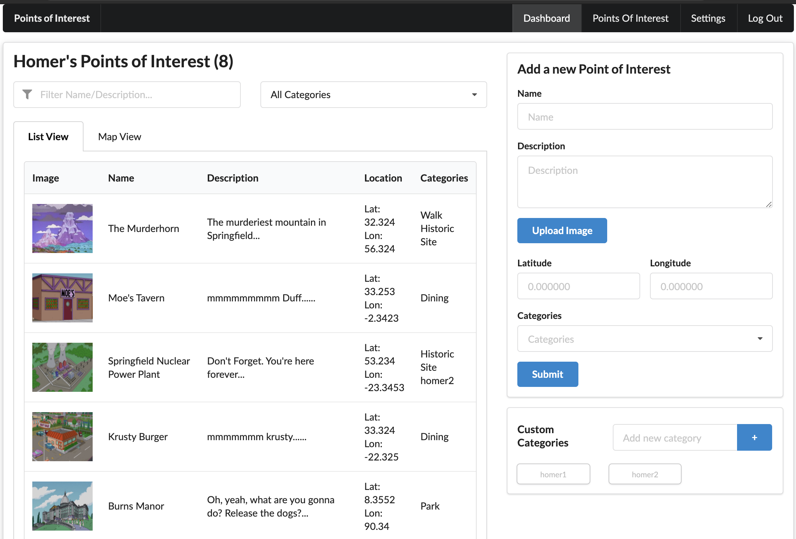

# Project - Points of Interest (POI) ReactJS app

Name: Kent Chadwick

## Overview

This is the third iteration of an application that allows users to add and view various points of interest, as developed in the web development and enterprise web modules of the WIT HDIP course. The [first iteration](https://github.com/kento-mc/poi-app) was a server-rendered web app, built with hapi.js and a MongoDB Atlas database. The [second iteration](https://github.com/kento-mc/poi-app) was an extension of the first, with a client SPA built with Aurelia, consuming an API built on top of the original hapi.js backend.

This third iteration is a React web app, fully rebuilt and implementing some additioanl features, consuming the same API served by the hapi.js backend. It includes the following features:
 
 + User signup
 + User login/authentication
 + Persistent authentication in browser. Tab or window can be closed and re-openened with the user's session and data still available.
 + Interactive navbar navigation to a user dashboard, full list of points of interest, and settings page displaying the user's details.
 + The user dashboard includes three sections:
   + The POI view panel, displaying a list of POIs
   + Add POI form
   + User custom categories
+ The main POI list page displays all POIs
+ The individual POI entries in the POI lists are clickable and direct the users to a display page for an individual POI. This page includes:
  + An enlarged thumbnail
  + All POI details
  + An interactive map showing the single POI location.
  + A gallery of smaller thumbnail links of other POI images.

## Setup requirements

1. Clone the repo for the backend/api server: https://github.com/kento-mc/poi-app/tree/react-api
   + Ensure that it is the "react-api" branch 
   + Note that the .env file is included in the repo to allow connection to the remote database
2. Run 'npm install'
3. Run 'npm start' to start the api server on port 3000 and seed the database
4. Clone this repo in a different directory
5. Run 'npm install'
6. Run 'npm run start' and enter 'y' when prompted to run the app on a port other than 3000
7. A new user can register, but two test users will also be available with relevant pre-populted data:
   + homer@simpson.com, password: 'secret'
   + bart@simpson.com, password: 'secret'
8. Note that with subsequent reboots of the api server, clearing the localStorage in the browser where the client app is running, and re-logging in will be necessary to receive a new token and fetch updated data. 


## API Data Model


#### User

```json
{
  "_id":"5f48db5e41b3780e64e9415d",
  "contributedPOIs":8,
  "firstName":"Homer",
  "lastName":"Simpson",
  "fullName":"Homer Simpson",
  "email":"homer@simpson.com",
  "password":"secret",
  "isAdmin":false,
  "customCategories":2,
  "__v":0
}
```

#### Point of Interest

```json
{
  "_id":"5f48db5f41b3780e64e9416c",
  "name":"Springfield Gorge",
  "description":"Jump it!",
  "location": {
    "lat":2.3243,
    "lon":35.4343
  },
  "categories": [
    "5f48db5f41b3780e64e94167"
  ],
  "imageURL": [
    "http://res.cloudinary.com/dwgak0rbs/image/upload/v1583703565/i8f4phhwngskyfnk45ym.png",
    "http://res.cloudinary.com/dwgak0rbs/image/upload/v1583703588/jvqbrydf3qxpen6hshzg.jpg"
  ],
  "contributor":"5f48db5e41b3780e64e9415f",
  "thumbnailURL":"http://res.cloudinary.com/dwgak0rbs/image/upload/v1583703565/i8f4phhwngskyfnk45ym.png",
  "__v":0
}
 ```
 
#### Category

```json
{
  "_id":"5f48db5f41b3780e64e94164",
  "name":"Dining",
  "description":"",
  "contributor":"5f48db5e41b3780e64e94163",
  "__v":0
}
```

## App Design

### Component catalogue


Additional compoonents not imiplemented in Storybook:
+ src/components/imageSingle/index.js
+ src/components/mapSingle/index.js
+ src/components/imageUploader/index.js
+ src/components/panel/index.js
+ src/components/poiTabs/index.js
+ src/components/privateRoute/index.js
+ src/components/router/index.js *This component is not used in final release version*


### UI Design


>Shows simple sigunup form, with fields for first and last names, email, and password.
-----


>Shows simple login form, with fields for email and password.
-----


>Displays a list of POIs with a thumbnail, name, description, location, and contributor. The POIs displyed on the list can be filtered for either name or description via text entry and also by a drowpdown selection of categories. The top form on the right panel allows a user to create a new POI, including uploading a local image file. The added POI will appear immediately in the list of POIs. The bottom form on the right panel allows the user to view their custom categories (certain categories are available by default) and add additional custom categories. The newly added categories will appear immediately in the dropdown list of available categories for selection in the above add POI form.
-----


>Another tab on the left dashboard panel displays the same list but on an interactive map with pins in the locaion of each POI. The pins are clickable to display the POI name and location coordinates. Subject to same filtering as the list view.
-----


> The main POI list has the same features as the POI view panel on the dashboard page, but includes all POIs from all contributors. In addition, the list/map is filterable by an additional metric - POI contributors.
-----


>An interactive map showing the locations of all POIs. Subject to same filtering as the list view.
-----


>Displays all POI data and an interactive map showing the POI location. Additional, smaller thumbnails of all POI images are displayed beneath the map. Each smaller thumbnail is clickable and opens the image full-size on its own page. 
-----


>Displays a full-size POI image. Also displays the smaller thumbnail links of other POI images below.
-----


>Displays user data.
-----


### Routing

+ /dashboard (private) - displays list/map of user POIs with filter controls and forms for adding new POIs and categories
+ /pois (private) - displays list/map of all POIs with filter controls
+ /pois/:id (private) - displays individual POI detail page
+ /pois/:id/update (private) - *not implemented in this release* displays form to update POI data
+ /pois/:id/images (private) - *not implemented in this release* displays thumbnails for POI images
+ /pois/:id/images/:image (private) - displays full size POI image and other POI images as clickable thumbnails underneath
+ /settings (private) - displays user data
+ /login - displays login form
+ /signup - displays signup form
+ / - redirects to /login or /dashboard if authenticated


## React feature set

+ useState and useEffect hooks - src/components/addPoiForm/index.js
+ useContext hook - src/pages/dashboardPage.js
+ useReducer hook - src/contexts/poiContext.js
+ useForm hook - src/components/loginForm/index.js
+ useRef hook - src/contexts/authContext2.js
+ Link - src/components/navBar/index.js
+ NavLink - src/components/navBar/index.js
+ Redirect - src/components/signup/index.js
+ Provider pattern - src/contexts/*.js
+ Container pattern - src/components/templateGlobal/index.js
+ Programmatic navigation (Declarative) - src/index.js
+ Programmatic navigation (Imperative) - src/components/imageGallery/index.js
+ Unidirectional dataflow - src/contexts/filterContext.js


## Independent learning

+ [Local Storage for persisting state/authentication](https://stackoverflow.com/questions/28314368/how-to-maintain-state-after-a-page-refresh-in-react-js) - as in src/contexts/poiContext.js - idea taken from linked Stack Overflow thread, with a custom implementation
+ [Advanced Web Form processing - React Hook Form](https://react-hook-form.com/) - 'react-hook-form' in src/components/addCategories.js and other forms - 
+ [Semanti UI React](https://react.semantic-ui.com/) - 'semantic-ui-react' in src/components/addPoiForm.js and many others - 
+ [React Leaflet](https://react-leaflet.js.org/) - 'react-leaflet' in src/components/poiMap.js - 
